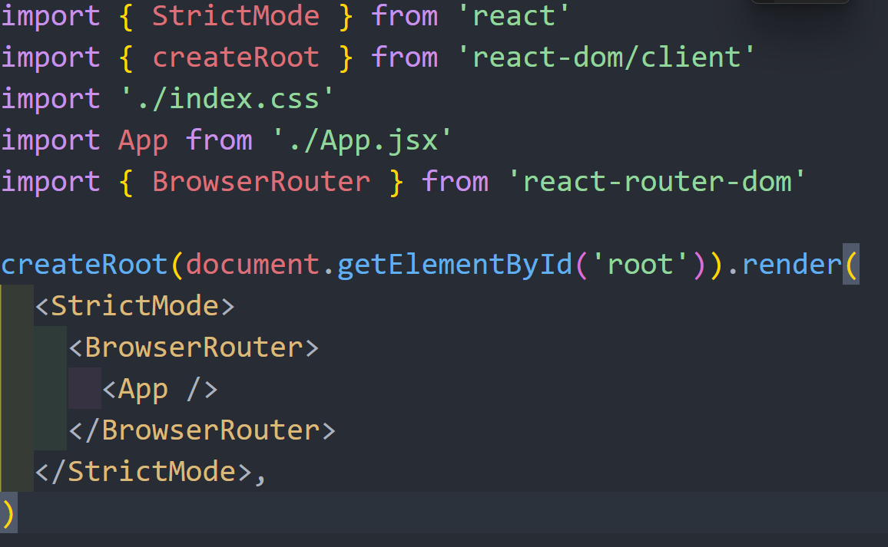

1. auto prefixer hume multiple browserws ke sath wokr krne ke lie compatible bna deta ha
2. routing mtlb hota ha ki aap ek page se dusre page par ja ske
3. react -router-dom se routing perform hoti ha

   
4. here **React Router DOM** is used. **React Router DOM** is a library used in **React** to handle navigation between different pages in a web application. It helps in creating **single-page applications (SPAs)** where different content is displayed without reloading the page.
5. with help of link to in react-router-dom we don't need to do any reloading
6. we have used context api for data centrailztion bcoz this is a small application so redux is not used
